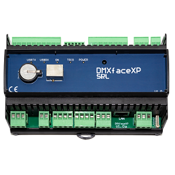

http://www.dmxface.at
## ioBroker.dmxface 2.0.0 Adapter (06.2024)
DMXface is a programmable IO controller with features as follows:
 DMX OUT and DMX IN bus
 8 to 16 INports with analog to digital support for all channels
 8 to 16 OUTports
 6 PWM LED driver ports up to 1A each channel
 IR receiver and transmitter port
 RS485 Bus for the connection of up to 8 LCD touch displays with 2.4 or 5 inches.
 LAN Interface supporting up to 7 individual configurable sockets
 USB Port for programming and communication
 RTC Clock with day of week / date
 Optional RS232, KNX, DALI, audio triggering, ... 
 Available resources:
  512+32 DMX Channels 
  198 Storeable scenes with fade times 0.0 to 600 Sec.   
  56 Programs  
  96 Event triggers   
  8 Recordable timelines with 50msek resolution  
  48 Sendsequences 
Dokumentation and communication protocoll downloads: 
http://www.dmxface.at
 
## DMXface adapter for ioBroker
This adapter connects the DMXfaceXP controller with ioBroker.
The communication protocoll used is the DMXface ACTIVE SEND protocoll.
Rev 2.0.0 creates string objects for additional requested channels to get all data forwarded from DMXface, not just the converted float.

## Setup the DMXface
To configure the DMXface controller, you need the 'DMXface Console' downloadable at http://www.dmxface.at
After connecting by USB, you can access and change the controllers setup und network settings as well programm the controller.

## DMXface network settings (Menu: DMXface settings / Network setup) 
Here you can configure a valid IP address for the DMXface controller.
To get the DMXface connected to the IO Broker you have as well to setup the socket 6 or 7:
Set it to 'TCP SERVER', 'ACTIVE SEND PROTOCOLL' with a valid PORT (Default = 6000).

## DMXface setup settings (Menu: DMXface settings / Basic setup) 
To receive IO Port changes or IR Remote control data, enable 'LAN SOCKET 6 or 7 sends ACTS messages' and select 
Outport change, Inport change and Infrared receive in the 'Send ACTS message at event' area below.
To receive DMX channel values enable 'LAN SOCKET 6 or 7 sends DMX channel values.
Select the number of DMX channels (max. 224) to be transmitted to ioBroker and the interval in which the channels are to be sent.
Save the changes, done.

## Add adapter to ioBroker
Add the DMXface adapter from github  https://github.com/DMXface/ioBroker.dmxface.git
Create an instance of the adapter.

## Adapter configuration
IP address:  Same as used for the DMXfaceXP controller.
Port: Same as configured in the network socket 6 or 7.
Last DMX channel used: Number of DMX state objects that will be created when the DMXface adapter ist started.
Additional channel requests:
DMXface covers the possibility to process values of DMX channels, AD values of IN- or BUSports by a conversion table. 
Here you can list additional ports that should be also available for ioBroker
Enter the required channel separated by semicolons like IN1, OUT5, DMX112, BUS1, CHAR1 
IN1 to IN16 - Inport AD Values  
OUT1 to OUT16 - OUTPORT Values  
DMX1 to DMX544 - DMX Channels  
BUS1 to BUS 32 - BUS Port AD values 
CHAR1 to CHAR12 - CharBuffers of the DMXface 

ioBroker requests the values one by one withing the timing and stores it in additional float numbers in states VALUE_... 

Power consumption and runtime tracking:

Here you can list IO and DMX ports, optional with the power of the load controlled by the channel.

Format is e.g. OUT5(750) this means that OUTPORT5 controls a 750W load.
If no powerload is added just the runtime will be tracked.
As soon there is a channel added you will get one or two new states for the port.
STAT_HRS_OUTPORT05 and if a power value is added the state STAT_KWH_OUTPORT05. 
STAT_KWH contains the KW/h and increases as soon OUTPORT5 is true.
STAT_HRS is the time in hours while OUTPORT5 was true.
If you use a DMX channel the power value rate is calculated with the value of the DMX channel.
A DMX value =0 is off, a DMX value of 128 adds half of the power value, a DMX value 255 adds full value to the POWER_xx value.
The STAT_HRS value increases as soon the DMX value is > 0. 

Request timing (ms): This value specifies the timing within the additional channels are requested one by one and the
power consumption and runtime is calculated. 

## 1.1.0
released for use with DMXfaceXP Controller

##  Changelog
1.0.0  Initial release 
1.0.1  Bugfixes (reconnect procedure after loosing TCP connection) 
1.0.2  File cleanup+ Bugfix (List of additional ports causes error @ first start due to NULL value 
1.1.0  New version of the adapter containing min/max tracking and power tracking)
## License
MIT License 

Copyright (c) 2020 SPaL Oliver Hufnagl <mail@dmxface.at> 

Permission is hereby granted, free of charge, to any person obtaining a copy
of this software and associated documentation files (the "Software"), to deal
in the Software without restriction, including without limitation the rights
to use, copy, modify, merge, publish, distribute, sublicense, and/or sell
copies of the Software, and to permit persons to whom the Software is
furnished to do so, subject to the following conditions:

The above copyright notice and this permission notice shall be included in all
copies or substantial portions of the Software.

THE SOFTWARE IS PROVIDED "AS IS", WITHOUT WARRANTY OF ANY KIND, EXPRESS OR
IMPLIED, INCLUDING BUT NOT LIMITED TO THE WARRANTIES OF MERCHANTABILITY,
FITNESS FOR A PARTICULAR PURPOSE AND NONINFRINGEMENT. IN NO EVENT SHALL THE
AUTHORS OR COPYRIGHT HOLDERS BE LIABLE FOR ANY CLAIM, DAMAGES OR OTHER
LIABILITY, WHETHER IN AN ACTION OF CONTRACT, TORT OR OTHERWISE, ARISING FROM,
OUT OF OR IN CONNECTION WITH THE SOFTWARE OR THE USE OR OTHER DEALINGS IN THE
SOFTWARE.